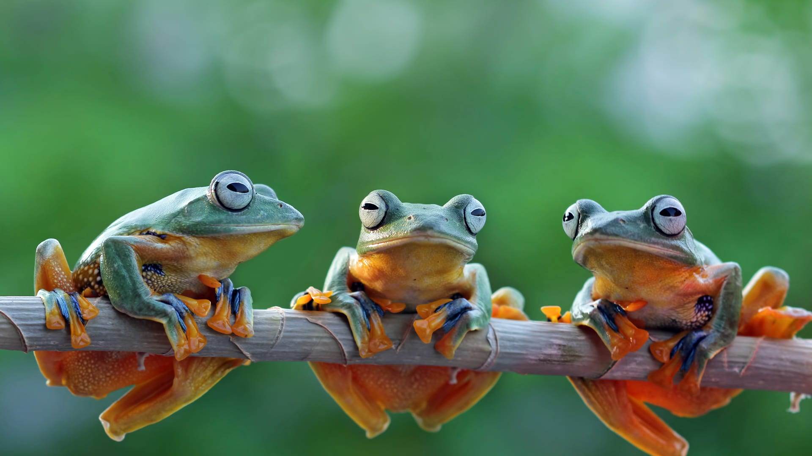

# _Animal Wiki_

#### _A small wiki describing some of our favorite reptiles and amphibians, current as of 1/14/2021_

#### By _**Mekinsie Callahan, Taylor Baker**_ 

## Description

_A small wiki describing some of our favorite reptiles and amphibians. Click on the button to select the type of animal you would like to learn about._

## Setup/Installation Requirements

* _Go to https://github.com/mekinsie/Animal-Wiki_
_or https://github.com/Taylor-Baker/Animal-Wiki_
* _Navigate to and click the green "Code" button on middle upper right part of webpage._
* _Copy the HTTPs address to your clipboard._
* _Open terminal or bash and navigate to the directory you wish to download the repo to._
* _Type into the terminal "git clone [paste HTTPs address] and press enter._
* _Open the file named "index.html" in the directory you just downloaded the repo to. This will open the portfolio page in your default web browser._

## Known Bugs

_There are no known bugs at this time._

## Support and contact details

_{Let people know what to do if they run into any issues or have questions, ideas or concerns.  Encourage them to contact you or make a contribution to the code.}_

## Technologies Used

### Languages

### Libraries

### Tools

### License

*This project is licensed under the MIT license.*

Copyright (c) 2020 **_Mekinsie Callahan, Taylor Baker_**